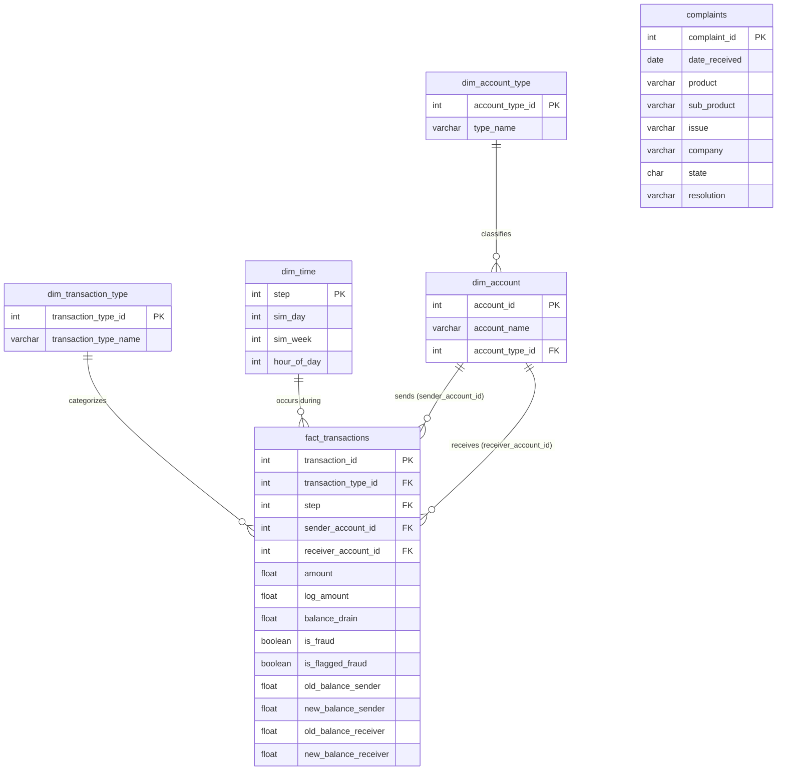

# Schema Diagram — FinFlow

ER diagram for the transactions schema (Option 2: Snowflake on the Account dimension).
Rendered with [Mermaid]( https://mermaid.js.org/syntax/entityRelationshipDiagram.html).

**Notes on the diagram:**
- `complaints` is intentionally disconnected — no foreign key ties it to `fact_transactions`. It comes from a different source (CFPB) and has no shared key with the transactions data.

- `dim_account` plays two roles on `fact_transactions` (sender and receiver).

- The `dim_account_type → dim_account` link is the snowflake: account type is normalized out of `dim_account` into its own table instead of being stored as a plain column there.
